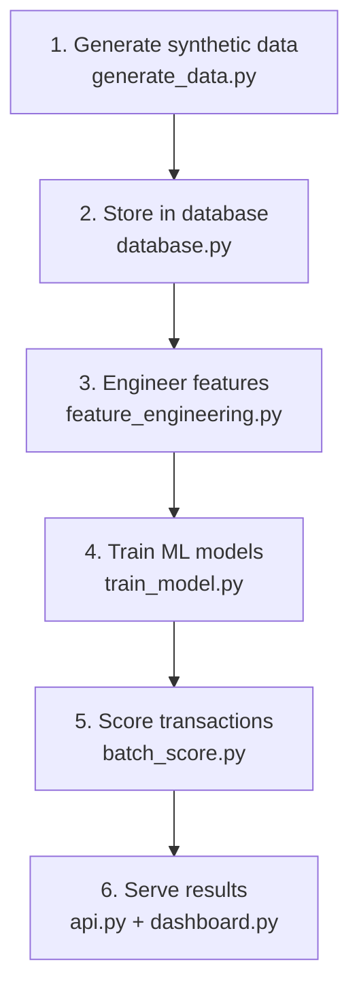

# UPI Fraud Detection System

A machine learning system that detects likely-fraudulent UPI (digital payment) transactions, built with **Python, SQL, and AI/ML**. It combines a supervised classifier with an unsupervised anomaly detector, stores data in SQL, and is served through a FastAPI backend and a Streamlit dashboard.

> **Note on data:** Real UPI transaction data is private and regulated, so this project uses realistic **synthetic data** (generated with [Faker](https://faker.readthedocs.io/)) with deliberately engineered fraud patterns (odd-hour transactions, unusually high amounts, new/unrecognized devices). This is the standard approach for a project like this.

---

## Workflow



Each stage's output feeds the next: synthetic data is stored in SQL, turned into features, used to train two models, applied to score every transaction, and finally served through the API and dashboard.

---

## Tech Stack

| Layer | Tool | Purpose |
|---|---|---|
| Data generation | Faker | Creates realistic synthetic users and transactions |
| Database | SQLite (via SQLAlchemy) | Stores users, transactions, flagged transactions |
| Feature engineering | pandas | Turns raw transactions into numeric ML features |
| Supervised model | scikit-learn (Random Forest) | Learns known fraud patterns from labeled data |
| Class balancing | imbalanced-learn (SMOTE) | Fixes the rare-fraud-event imbalance problem |
| Anomaly detection | scikit-learn (Isolation Forest) | Flags unusual patterns without needing labels |
| Backend API | FastAPI | Real-time transaction scoring endpoint |
| Dashboard | Streamlit | Visual interface: charts, flagged list, live tester |

---

## How Fraud Detection Works

**Features used per transaction:** amount, amount deviation from the sender's personal average, new-device flag, odd-hour flag (midnight–5 AM or 11 PM), high-amount flag (top 10%), and hour of day.

**Random Forest (supervised):** 200 decision trees trained on SMOTE-balanced data (since only ~5% of transactions are fraud, without balancing a model could reach high accuracy by simply never predicting fraud).

**Isolation Forest (unsupervised):** doesn't use fraud labels at all — it isolates unusual data points with random splits, acting as a safety net for fraud patterns the labeled data didn't cover.

**Final risk score:**

```
risk_score = 0.7 × RandomForest_probability + 0.3 × anomaly_flag
```

A transaction is flagged as fraud when `risk_score ≥ 0.5`.

---

## Project Structure

```
upi_fraud_detection/
├── schema.sql                # SQL schema (users, transactions, flagged_transactions)
├── generate_data.py          # Step 1: create synthetic dataset
├── database.py                # Step 2: SQLite DB setup + load data
├── feature_engineering.py     # Step 3: turn raw transactions into ML features
├── train_model.py             # Step 4: train RandomForest + IsolationForest
├── batch_score.py             # Step 5: score all transactions, save to DB
├── api.py                     # Step 6: FastAPI backend (real-time scoring)
├── dashboard.py                # Step 7: Streamlit dashboard
├── requirements.txt
└── README.md
```

---

## How to Run

```bash
# 1. Install dependencies
pip install -r requirements.txt

# 2. Generate synthetic data (creates users.csv, transactions.csv)
python generate_data.py

# 3. Create SQLite DB and load the data
python database.py

# 4. Train the ML models (saves .pkl files)
python train_model.py

# 5. Score all transactions and store predictions in the DB
python batch_score.py

# 6. Start the API (in one terminal)
uvicorn api:app --reload
# → visit http://127.0.0.1:8000/docs

# 7. Start the dashboard (in another terminal)
streamlit run dashboard.py
```

---

## Results

On a held-out test set of 1,000 transactions:

| Metric | Score |
|---|---|
| Precision | 1.00 |
| Recall | 1.00 |
| F1-score | 1.00 |

These are unusually clean numbers because this is synthetic data with deliberately distinct fraud patterns. Real-world fraud detection would realistically show lower scores, since genuine fraud overlaps more with normal behavior.

---

## Interview / Viva Talking Points

**Why synthetic data instead of real UPI data?**
Real transaction data is private and regulated (banking data, PII). Synthetic data with realistic fraud patterns is the standard, expected approach for a project like this.

**Why SMOTE?**
Fraud is a rare-event problem. Without balancing, a model can reach high accuracy by simply predicting "not fraud" every time. SMOTE generates synthetic minority-class (fraud) examples so the model actually learns fraud patterns.

**Why precision/recall instead of just accuracy?**
With imbalanced classes, accuracy is misleading. Recall matters most — missing real fraud (a false negative) is usually costlier than a false alarm.

**Why two models instead of one?**
Random Forest is strong on patterns it was trained on. Isolation Forest doesn't need labels at all, so it can catch new, unseen fraud patterns — a safety net against blind spots.

**What would you change for production?**
Use real (anonymized) transaction data, add behavioral features like transaction velocity and account-graph relationships, retrain periodically as fraud patterns evolve, and add authentication/rate-limiting to the API.

---

## Limitations & Future Improvements

- Synthetic data has clean, separable fraud patterns; real-world fraud is noisier
- No transaction-velocity features (multiple transactions in a short window)
- No graph-based features (detecting rings of connected accounts)
- No authentication on the API
- No automatic retraining pipeline
- **Next steps:** deploy the API and dashboard (Render/Railway), add a login layer, add velocity/graph features, connect to a real anonymized dataset if available

---

## Author

**Mohd. Razi Khan**
GitHub: [@Razikhan786](https://github.com/Razikhan786)
Repository: [UPI-fraud-detection](https://github.com/Razikhan786/UPI-fraud-detection)

## License

This project is for educational/portfolio purposes.
